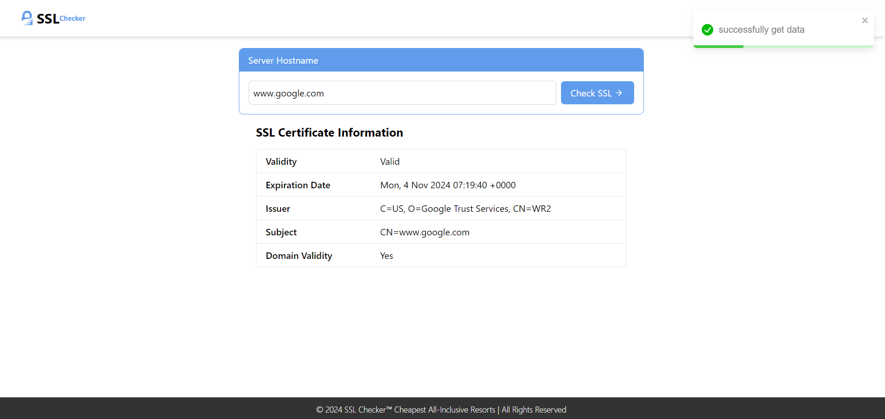

# SSL CERTIFICATE CHECKER 🔥

An SSL certificate is like a digital ID for a website that helps protect your information when you visit. It creates a secure, encrypted connection between your browser and the website, making sure that data like passwords or credit card numbers can't be stolen or tampered with.

## Setup Guide: Project

- Copy the repository's URL .
- Open your terminal or command prompt.
- Use the git clone command followed by the URL:

```
git clone <repository-url>
```

## Setup Guide: Rust & Next.js Development Environment

- ### Navigate to the frontend folder:
  Once the repository is cloned, navigate to the frontend directory. the folder is named front-end

```
cd front-end
```

- ### Install dependencies (Next.js) and Start Server:
  In the frontend folder, install all the project dependencies:

```
npm install
npm run dev
```

- ### Navigate to the backend folder:
  Open a new terminal window or tab, and navigate to the backend directory. the folder is named back-end

```
cd back-end
```

- ### Build and run the backend:
  To build and run the backend, use the following commands

```
cargo build
cargo run
```

or

```
cargo run
```



# [Watch the video](./ssl.mp4)
